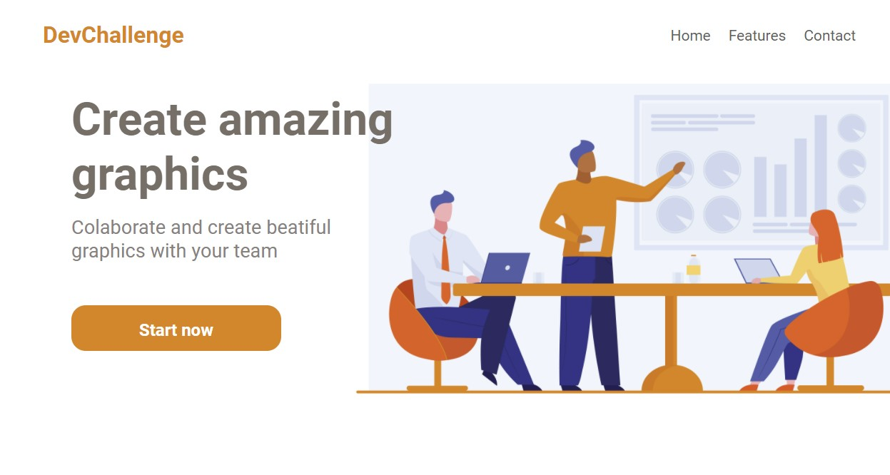

 

  

  <h3 align="center">Amazing Graph</h3>

  

    Landing page to create amazing graphics
        
     
    <a href="https://github.com/Lorenalgm/AmazingGraph">Challenge</a>
    ·
    <a href="https://www.linkedin.com/in/lorenagmontes/">Contact</a>
  

 <h1>Sobre</h1>

<a href="https://devchallenge.now.sh/"> DevChallenge</a> que disponibilizou esse template criado pela <a href="https://github.com/Lorenalgm">Lorena</a>. Desenvolvi esse desafio usando <em>HTML5, CSS3</em> e <em>media queries</em> para deixar o site responsivo. E também esse foi o primeiro desafio de front-end como você podem percebem na organização do código e o posicionamento dos elementos.
  

<h1>Tecnologia</h1>
  <ul>
    <li><b>HTML</b></li>
    <li><b>CSS3</b></li>
    <li><b>Media Querie</b></li>
  </ul>
  
  <h1>Demonstração Final</h1>
 
