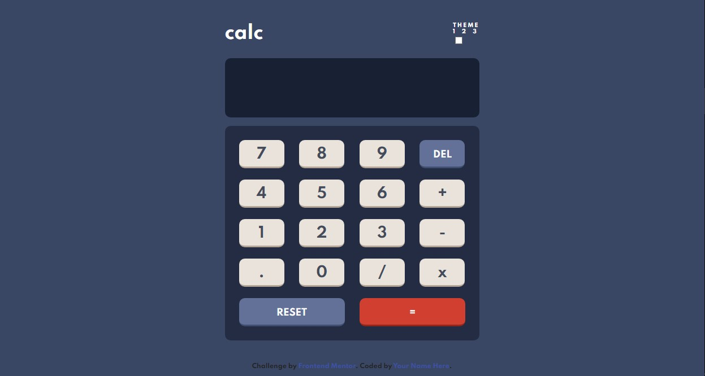

<h1 align= "center">
  <a href = "https://eduardodamaceno.github.io/challenges-front/challenges/calculator-app-main
/index.html" target="_blank">Frontend Mentor - Calculator app</h1>

## Sobre

Uma página web simples de uma calculadora para praticar a lógica e o JavaScript usando <em>HTML, CSS e JavaScript.</em>

 
<h1>Tecnologia</h1>
  <ul>
    <li><b>HTML</b></li>
    <li><b>CSS3</b></li>
    <li><b>JavaScript</b></li>
  </ul>
  
  <h1>Demonstração Final</h1>
  
Clique na imagem para ir até a aplicação web

 
