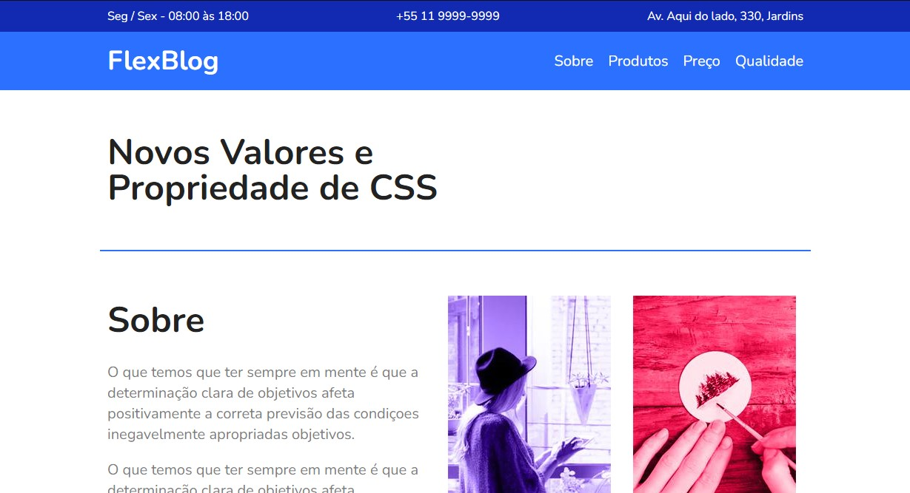

  <h1 align= "center">
    <a href = "https://eduardodamaceno.github.io/challenges-front/challenges/calculator-app-main
  /index.html" target="_blank">Frontend Mentor - Calculator app </h1>
  

  <h1>Sobre</h1>

  
Página web simulando um blog, usei esse site para colocar em prática o conhecimento adquirido com <em>CSS FlexBox</em> e usei também <em>HTML, CSS</em>

  <h1>Tecnologia</h1>
    <ul>
      <li><b>HTML</b></li>
      <li><b>CSS3</b></li>
      <li><b>FlexBox</b></li>
    </ul>

   <h1>Demonstração Final</h1>
   
Clique na imagem para ir até a aplicação web

    
