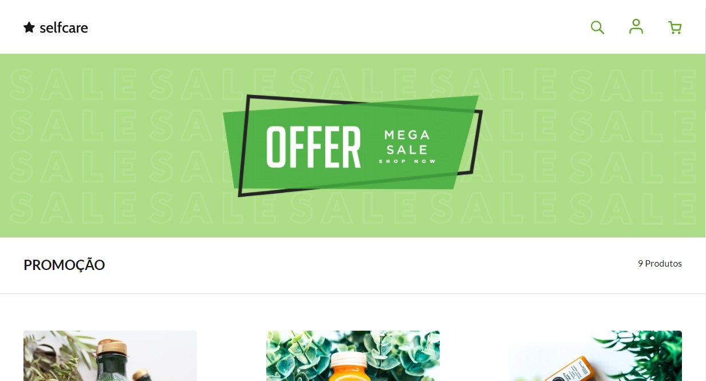

 

  
  
   

  <h1 align="center">SelfCare</h1>

  

    Crie uma página para exibição de produtos
        
     
    <a href="https://github.com/thaysagomes/selfcare">Desafio</a>
    ·
    <a href="https://www.linkedin.com/in/tcgms/">Contato</a>
  

<h1>Sobre</h1>

<a href="https://devchallenge.now.sh/"> DevChallenge</a> que disponibilizou esse template criado pela <a href="https://github.com/thaysagomes">Thaysa Gomes</a>. Desenvolvi esse desafio usando <em>HTML5, CSS3, Flex Box e Media Queries</em> para deixar o site responsivo.

<h1>Tecnologia</h1>
  <ul>
    <li><b>HTML</b></li>
    <li><b>CSS3</b></li>
    <li><b>Flex Box</b></li>
    <li><b>Media Querie</b></li>
  </ul>
  
<h1>Demonstração Final</h1>
  
Clique na imagem para ir até a aplicação web

 
