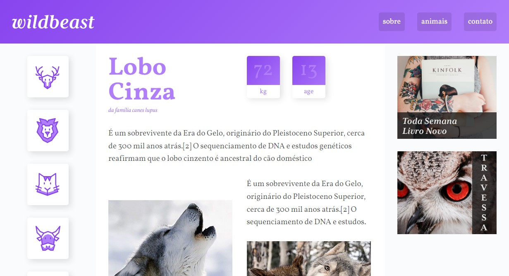

<h1 align= "center">
  <a href = "https://eduardodamaceno.github.io/challenges-front/challenges/wildbeast
/index.html" target="_blank">WildBeast</h1>

## Sobre

Uma página web simples de para praticar o conteúdo aprendido sobre CSS Grid Layout e tambem usei <em>HTML, CSS.</em>

 
<h1>Tecnologia</h1>
  <ul>
    <li><b>HTML</b></li>
    <li><b>CSS3</b></li>
    <li><b>Grid Layout</b></li>
  </ul>
  
  <h1>Demonstração Final</h1>
  
Clique na imagem para ir até a aplicação web

 
